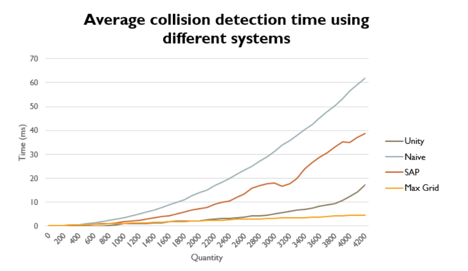

# Optimised broad-phase for fast 2D physics simulation

For the full report, see Report.pdf.

## Abstract

Physics simulations are a foundation of all modern game engines, as they are indispensable 
for maintaining the illusion that a virtual environment is real. However, they are often 
among the most performance heavy systems involved. This project serves to determine 
whether this performance cost is efficiently managed by game engines, or if hand-built 
systems can be better. This is explored through the development of hand-built physics 
simulations and game engine driven ones, highlighting what optimisations are practical in 
the former but not in the latter, and comparing how well they perform. The findings show 
how such optimisations can lead to significantly better performances, even when compared 
to systems used by highly optimised game engines, showing that the use of engines should 
not be a default for simulating physics, but an option for when performance is not critical.

## Results

Using the novel Max Grid broad-phase algorithm, a significantly better performance was achieved
for the simulated system than can be achieved using Unity's built-in 2D physics simulator. The results
are shown below.

## See for yourself

The JavaScript simulation can be run by opening index.html (in the JavaScriptSim directory) in any browser.
It does not require a local server to be started.

The Unity simulation requires a local server. With python 3 installed, the following command should work (from the UnitySim directory):
python3 -m http.server --cgi 8360
The server should now be available at http://localhost:8360/ 
